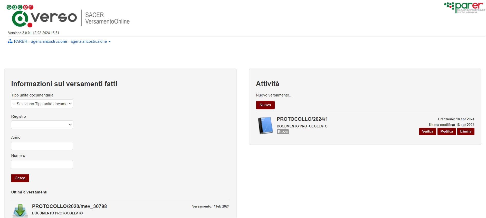
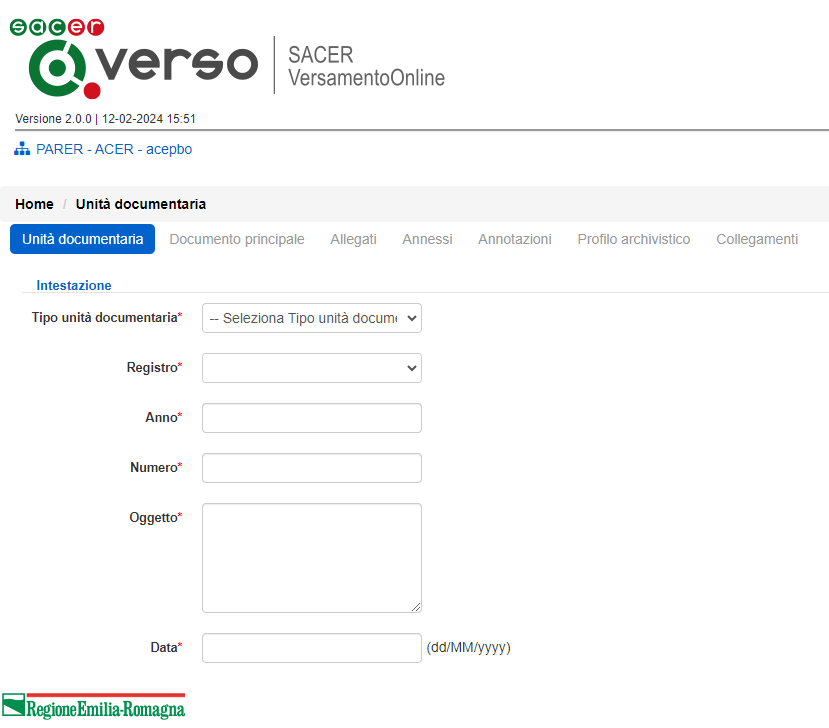

# Verso (Versamento Online)

Fonte template redazione documento:  https://www.makeareadme.com/.


# Descrizione

Il client di versamento manuale VersO (Versamento Online) è un modulo che ParER mette a disposizione degli Enti produttori per svolgere operazioni routinarie sul sistema. Poiché utilizza un’interfaccia web, non richiede l’installazione di alcun software sulla stazione di lavoro dell’Utente. 

# Installazione

Requisiti minimi per installazione: 

- Sistema operativo : consigliato Linux server (in alternativa compatibilità con Windows server);
- Java versione 8 (OpenJDK / Oracle);
- JBoss 7 EAP;
- Oracle DB (versione consigliata 19c).

## Instalazione JDK 

Consigliata adozione della OpenJDK alla versione 8, guida all'installazione https://openjdk.org/install/.

## Setup application server (Jboss 7)

Richiesta l'esecuzione delle seguenti guide secondo l'ordine riportato di seguito: 

1. guida per la configurazione **base** di [guida 1](src/docs/JBoss7_configurazione_generale.md);
2. guida con le configurazioni **specifiche** per il contesto applicativo **VERSO**  di [guida 2](src/docs/JBoss7_configurazione_verso.md).

### Deploy su JBoss 7

Di seguito le indicazioni per il rilascio su application server JBoss7: 

1. generazione dell'artifact attraverso tool maven, eseguire il seguente comando: 

   ```bash
   mvn package
   ```
   
2. viene generato l'artifact .war all'interno del modulo target (e.g. verso-1.8.0.war)
3. deploy dell'ear generato allo step 1 su JBoss 7 (vedi configurazione [setup JBoss7](#setup-application-server-jboss-7))


## Predisposizione database

L'applicazione utilizza come DBMS di riferimento Oracle DB (https://www.oracle.com/it/database/) alla versione, consigliata, **19c**. Per l'installazione e la configurazione fare riferimento alle guide ufficiali.

Per la creazione del modello E-R consultare il seguente [README.md](https://github.com/RegioneER/parer-db-init/blob/master/README.md) (progetto di riferimento https://github.com/RegioneER/parer-db-init).


# Utilizzo

Il suo utilizzo tipico è il versamento di Unità documentarie per le quali non esiste un sistema interfacciato con Sacer. VersO viene richiamato tramite interfaccia web, si autentica sull’IdP di ParER o su SPID, utilizzando in ogni caso logiche di profilazione del Sistema, ed effettua il versamento dei SIP tramite interazione guidata con l’operatore del Produttore. 

Tale modulo semplifica le operazioni di versamento manuale da parte del Produttore, automatizzando la generazione dell’Indice del SIP ed effettuando un test completo della correttezza del versamento prima di eseguire il versamento stesso. Inoltre, mantiene il log dei versamenti effettuati e consente di interrompere temporaneamente l’operazione (p.e per raccogliere informazioni necessarie per completarlo), riprendendola successivamente, indipendentemente dalla scadenza della sessione web. 


La schermata di accesso del sistema si compone di una sezione dedicata alla ricerca dei versamenti effettuati e di una sezione per la gestione dei nuovi versamenti. 


 

La maschera di gestione di un versamento guida l'utente nel processo di creazione del pacchetto di versamento SIP. 

 

# Requisiti e librerie utilizzate

Requisiti minimi per installazione: 

- Sistema operativo : consigliato Linux server (in alternativa compatibilità con Windows server)
- Java versione 17 (OpenJDK / Oracle)
- Kubernetes / Docker : se rilasciato attraverso container oppure si esegue una build del progetto attraverso il profilo maven **uber-jar** per ottenere il JAR eseguibile (vedi paragrafi precendeti)

# Librerie utilizzate


|  GroupId | ArtifactId  | Version |
|:---:|:---:|:---:|
|cglib|cglib-nodep|3.3.0|
|com.fasterxml.jackson.core|jackson-annotations|2.12.7.redhat-00003|
|com.fasterxml.jackson.core|jackson-core|2.12.7.redhat-00003|
|com.fasterxml.jackson.core|jackson-databind|2.12.7.redhat-00003|
|com.fasterxml.woodstox|woodstox-core|6.4.0.redhat-00001|
|com.intellij|annotations|7.0.3|
|com.io7m.xom|xom|1.2.10|
|com.manydesigns|elements-extras|4.0.8|
|com.manydesigns|elements|4.1.beta6|
|com.narupley|not-going-to-be-commons-ssl|0.3.20|
|com.sun.activation|jakarta.activation|1.2.2.redhat-00001|
|com.sun.mail|jakarta.mail|1.6.7.redhat-00001|
|com.sun.xml.bind|jaxb-impl|2.3.5|
|com.sun.xml.fastinfoset|FastInfoset|1.2.18|
|com.sun.xml.messaging.saaj|saaj-impl|1.5.3|
|com.sun.xml.stream.buffer|streambuffer|1.5.10|
|com.sun.xml.ws|jaxws-rt|2.3.5|
|com.sun.xml.ws|policy|2.7.10|
|com.zaxxer|SparseBitSet|1.2|
|commons-codec|commons-codec|1.15|
|commons-collections|commons-collections|3.2.2|
|commons-configuration|commons-configuration|1.10|
|commons-dbutils|commons-dbutils|1.7|
|commons-fileupload|commons-fileupload|1.5|
|commons-httpclient|commons-httpclient|3.1|
|commons-io|commons-io|2.12.0|
|commons-lang|commons-lang|2.5|
|commons-logging|commons-logging|1.2|
|commons-net|commons-net|3.9.0|
|it.eng.parer|spagofat-core|6.14.1|
|it.eng.parer|spagofat-middle|6.14.1|
|it.eng.parer|spagofat-si-client|6.14.1|
|it.eng.parer|spagofat-si-util|6.14.1|
|it.eng.parer|spagofat-webresources|6.14.1|
|jakarta.annotation|jakarta.annotation-api|1.3.5|
|jakarta.jws|jakarta.jws-api|2.1.0|
|jakarta.xml.bind|jakarta.xml.bind-api|2.3.3|
|jakarta.xml.soap|jakarta.xml.soap-api|1.4.2|
|jakarta.xml.ws|jakarta.xml.ws-api|2.3.3|
|javassist|javassist|3.8.0.GA|
|javax.activation|activation|1.1.1|
|javax.annotation|javax.annotation-api|1.3.2|
|javax.servlet.jsp.jstl|jstl-api|1.2|
|javax.servlet.jsp|jsp-api|2.1|
|javax.servlet|servlet-api|2.5|
|javax.xml.bind|jaxb-api|2.3.0|
|javax.xml.soap|javax.xml.soap-api|1.4.0|
|javax.xml.ws|jaxws-api|2.3.1|
|jaxen|jaxen|1.2.0|
|joda-time|joda-time|2.12.5|
|junit|junit|4.13.2|
|net.datasiel|basewebapp|1.0.beta0|
|net.sourceforge.stripes|stripes|1.5.8|
|ognl|ognl|3.3.4|
|org.apache.commons|commons-collections4|4.4|
|org.apache.commons|commons-lang3|3.12.0|
|org.apache.commons|commons-math3|3.6.1|
|org.apache.commons|commons-text|1.10.0|
|org.apache.httpcomponents|httpclient|4.5.14|
|org.apache.httpcomponents|httpcore|4.4.14.redhat-00001|
|org.apache.httpcomponents|httpmime|4.5.14|
|org.apache.logging.log4j|log4j-api|2.18.0|
|org.apache.poi|poi|5.2.3|
|org.apache.santuario|xmlsec|2.2.3.redhat-00001|
|org.apache.velocity|velocity-engine-core|2.0|
|org.apache.xmlbeans|xmlbeans|5.1.1|
|org.bouncycastle|bcpkix-jdk15on|1.70|
|org.bouncycastle|bcprov-jdk15on|1.70|
|org.bouncycastle|bcutil-jdk15on|1.70|
|org.codehaus.jettison|jettison|1.5.4|
|org.codehaus.woodstox|stax2-api|4.2.1.redhat-00001|
|org.glassfish.external|management-api|3.2.3|
|org.glassfish.gmbal|gmbal-api-only|4.0.3|
|org.glassfish.ha|ha-api|3.1.13|
|org.hamcrest|hamcrest-core|1.3|
|org.javassist|javassist|3.27.0.GA-redhat-00001|
|org.jboss.logging|jboss-logging|3.4.1.Final-redhat-00001|
|org.jdom|jdom2|2.0.6.1|
|org.json|json|20090211|
|org.jvnet.mimepull|mimepull|1.9.15|
|org.jvnet.staxex|stax-ex|1.8.3|
|org.keycloak|keycloak-adapter-core|21.1.1|
|org.keycloak|keycloak-adapter-spi|21.1.1|
|org.keycloak|keycloak-authz-client|21.1.1|
|org.keycloak|keycloak-common|21.1.1|
|org.keycloak|keycloak-core|21.1.1|
|org.keycloak|keycloak-crypto-default|21.1.1|
|org.keycloak|keycloak-policy-enforcer|21.1.1|
|org.keycloak|keycloak-server-spi-private|21.1.1|
|org.keycloak|keycloak-server-spi|21.1.1|
|org.keycloak|keycloak-servlet-adapter-spi|21.1.1|
|org.keycloak|keycloak-servlet-filter-adapter|21.1.1|
|org.opensaml|opensaml|2.6.6|
|org.opensaml|openws|1.5.6|
|org.opensaml|xmltooling|1.4.6|
|org.owasp.esapi|esapi|2.2.0.0|
|org.reactivestreams|reactive-streams|1.0.3.redhat-00003|
|org.slf4j|slf4j-api|2.0.7|
|org.springframework.security.extensions|spring-security-saml2-core|1.0.10.RELEASE|
|org.springframework.security|spring-security-config|5.8.8|
|org.springframework.security|spring-security-core|5.8.8|
|org.springframework.security|spring-security-crypto|5.8.8|
|org.springframework.security|spring-security-web|5.8.8|
|org.springframework|spring-aop|5.3.30|
|org.springframework|spring-beans|5.3.30|
|org.springframework|spring-context-support|5.3.30|
|org.springframework|spring-context|5.3.30|
|org.springframework|spring-core|5.3.30|
|org.springframework|spring-expression|5.3.30|
|org.springframework|spring-jcl|5.3.30|
|org.springframework|spring-jdbc|5.3.30|
|org.springframework|spring-test|5.3.30|
|org.springframework|spring-tx|5.3.30|
|org.springframework|spring-web|5.3.30|
|org.springframework|spring-webmvc|5.3.30|
|xalan|serializer|2.7.2|
|xalan|xalan|2.7.2|
|xerces|xercesImpl|2.12.0|
|xml-apis|xml-apis|1.4.01|


## Lista licenze in uso


 * agpl_v3     : GNU Affero General Public License (AGPL) version 3.0
 * apache_v2   : Apache License version 2.0
 * bsd_2       : BSD 2-Clause License
 * bsd_3       : BSD 3-Clause License
 * cddl_v1     : COMMON DEVELOPMENT AND DISTRIBUTION LICENSE (CDDL) Version 1.0
 * epl_only_v1 : Eclipse Public License - v 1.0
 * epl_only_v2 : Eclipse Public License - v 2.0
 * epl_v1      : Eclipse Public + Distribution License - v 1.0
 * epl_v2      : Eclipse Public License - v 2.0 with Secondary License
 * eupl_v1_1   : European Union Public License v1.1
 * fdl_v1_3    : GNU Free Documentation License (FDL) version 1.3
 * gpl_v1      : GNU General Public License (GPL) version 1.0
 * gpl_v2      : GNU General Public License (GPL) version 2.0
 * gpl_v3      : GNU General Public License (GPL) version 3.0
 * lgpl_v2_1   : GNU General Lesser Public License (LGPL) version 2.1
 * lgpl_v3     : GNU General Lesser Public License (LGPL) version 3.0
 * mit         : MIT-License

# Supporto

Mantainer del progetto è [Engineering Ingegneria Informatica S.p.A.](https://www.eng.it/).

# Contributi

Se interessati a crontribuire alla crescita del progetto potete scrivere all'indirizzo email <a href="mailto:areasviluppoparer@regione.emilia-romagna.it">areasviluppoparer@regione.emilia-romagna.it</a>.

# Credits

Progetto di proprietà di [Regione Emilia-Romagna](https://www.regione.emilia-romagna.it/) sviluppato a cura di [Engineering Ingegneria Informatica S.p.A.](https://www.eng.it/).

# Licenza

Questo progetto è rilasciato sotto licenza GNU Affero General Public License v3.0 or later ([LICENSE.txt](LICENSE.txt)).

# Appendice

Link ad eventuali pagine istituzionali relative al progetto o al contesto di utilizzo; 

* Sito ParER: https://poloarchivistico.regione.emilia-romagna.it/ 
* Manuale utente https://poloarchivistico.regione.emilia-romagna.it/documentazione/verso-manuale-utente
* Manuale di conservazione: https://poloarchivistico.regione.emilia-romagna.it/documentazione/documenti_open/manualeconservazione_v5-0.pdf/@@download/file/ManualeConservazione_v2.0.pdf 
